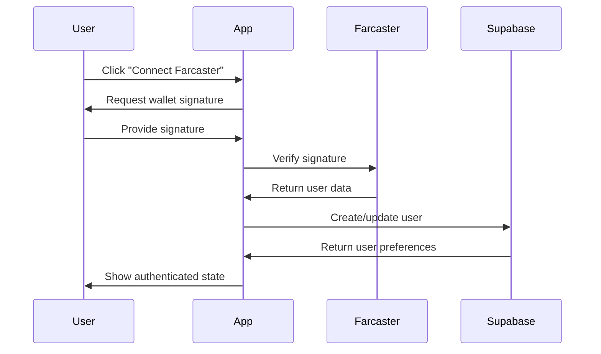

# ChronoFilter API Documentation

## Overview

ChronoFilter integrates with multiple APIs to provide comprehensive Twitter feed filtering and analysis. This document outlines all API integrations, their purposes, and implementation details.

## Table of Contents

1. [OpenAI API](#openai-api)
2. [Farcaster API](#farcaster-api)
3. [Supabase API](#supabase-api)
4. [Airstack API](#airstack-api)
5. [Etherscan API](#etherscan-api)
6. [Authentication Flow](#authentication-flow)
7. [Error Handling](#error-handling)
8. [Rate Limiting](#rate-limiting)

## OpenAI API

### Purpose
Provides AI-powered sentiment analysis, credibility scoring, and bot detection for tweets.

### Configuration
```javascript
const openai = new OpenAI({
  apiKey: process.env.VITE_OPENAI_API_KEY,
  dangerouslyAllowBrowser: true // Note: Use backend proxy in production
})
```

### Endpoints Used

#### Chat Completions
- **Endpoint**: `/v1/chat/completions`
- **Method**: POST
- **Purpose**: Analyze tweet content for sentiment, credibility, and bot probability

**Request Format:**
```javascript
{
  model: "gpt-3.5-turbo",
  messages: [
    {
      role: "system",
      content: "You are an expert content analyst..."
    },
    {
      role: "user", 
      content: "Analyze this tweet: \"[tweet content]\""
    }
  ],
  temperature: 0.3,
  max_tokens: 150
}
```

**Response Format:**
```javascript
{
  sentiment: "positive" | "neutral" | "negative",
  credibilityScore: 0.0 - 1.0,
  botProbability: 0.0 - 1.0
}
```

### Implementation
- **File**: `src/services/aiService.js`
- **Function**: `analyzeTweetWithAI(content)`
- **Fallback**: Mock analysis if API unavailable

### Rate Limits
- **Tier 1**: 3 RPM, 200 RPD
- **Tier 2**: 60 RPM, 10,000 RPD
- **Monitoring**: Track usage to prevent overages

## Farcaster API

### Purpose
Handles user authentication, profile data, and social graph information.

### Configuration
```javascript
const farcasterApi = axios.create({
  baseURL: 'https://api.farcaster.xyz',
  headers: {
    'Authorization': `Bearer ${FARCASTER_API_KEY}`
  }
})
```

### Endpoints Used

#### Authentication Verification
- **Endpoint**: `/auth/verify`
- **Method**: POST
- **Purpose**: Verify wallet signature and authenticate user

**Request:**
```javascript
{
  address: "0x...",
  signature: "0x...",
  message: "Sign in to ChronoFilter at [timestamp]"
}
```

**Response:**
```javascript
{
  fid: "12345",
  username: "user123",
  display_name: "User Name",
  pfp_url: "https://...",
  verified_addresses: ["0x..."],
  follower_count: 150,
  following_count: 75
}
```

#### User Connections
- **Endpoint**: `/users/{fid}/connections`
- **Method**: GET
- **Purpose**: Fetch user's social graph

#### User Casts
- **Endpoint**: `/casts`
- **Method**: GET
- **Parameters**: `fid`, `limit`
- **Purpose**: Retrieve user's posts/casts

### Implementation
- **File**: `src/services/farcasterService.js`
- **Class**: `FarcasterAuthService`
- **Mock Mode**: Available for development

## Supabase API

### Purpose
Backend database for user preferences, tweet analysis cache, and interaction tracking.

### Configuration
```javascript
const supabase = createClient(
  process.env.VITE_SUPABASE_URL,
  process.env.VITE_SUPABASE_ANON_KEY
)
```

### Database Schema

#### Users Table
```sql
CREATE TABLE users (
  id UUID PRIMARY KEY DEFAULT gen_random_uuid(),
  farcaster_id TEXT UNIQUE NOT NULL,
  twitter_handle TEXT,
  preferred_sources TEXT[],
  blocked_sources TEXT[],
  sentiment_preference TEXT DEFAULT 'neutral',
  credibility_threshold REAL DEFAULT 0.5,
  hide_bots BOOLEAN DEFAULT true,
  subscription_tier TEXT DEFAULT 'free',
  subscription_status TEXT DEFAULT 'inactive',
  created_at TIMESTAMP DEFAULT NOW(),
  updated_at TIMESTAMP DEFAULT NOW()
);
```

#### Tweet Analysis Table
```sql
CREATE TABLE tweet_analysis (
  id UUID PRIMARY KEY DEFAULT gen_random_uuid(),
  tweet_id TEXT UNIQUE NOT NULL,
  content TEXT NOT NULL,
  author_username TEXT NOT NULL,
  credibility_score REAL NOT NULL,
  bot_probability REAL NOT NULL,
  sentiment TEXT NOT NULL,
  analyzed_at TIMESTAMP DEFAULT NOW(),
  created_at TIMESTAMP DEFAULT NOW()
);
```

#### User Interactions Table
```sql
CREATE TABLE user_interactions (
  id UUID PRIMARY KEY DEFAULT gen_random_uuid(),
  user_id UUID REFERENCES users(id),
  tweet_id TEXT NOT NULL,
  action TEXT NOT NULL,
  created_at TIMESTAMP DEFAULT NOW()
);
```

### API Operations

#### User Management
- **Create/Update User**: `upsertUser(userData)`
- **Get User**: `getUserByFarcasterID(farcasterID)`
- **Update Preferences**: `updateUserPreferences(farcasterID, preferences)`

#### Source Management
- **Block Source**: `blockSource(farcasterID, username)`
- **Unblock Source**: `unblockSource(farcasterID, username)`
- **Prefer Source**: `preferSource(farcasterID, username)`
- **Unprefer Source**: `unpreferSource(farcasterID, username)`

#### Interaction Tracking
- **Record Interaction**: `recordInteraction(farcasterID, tweetID, action)`
- **Get Interactions**: `getUserInteractions(farcasterID, limit)`

### Implementation
- **File**: `src/services/userService.js`
- **Class**: `UserService`
- **Fallback**: Local storage for offline mode

### Row Level Security (RLS)
- Users can only access their own data
- Tweet analysis is publicly readable
- Interactions are user-scoped

## Airstack API

### Purpose
Enhanced social graph analysis and cross-platform identity resolution.

### Configuration
```javascript
const airstackApi = axios.create({
  baseURL: 'https://api.airstack.xyz/gql',
  headers: {
    'Authorization': `Bearer ${AIRSTACK_API_KEY}`
  }
})
```

### GraphQL Queries

#### Social Graph Query
```graphql
query GetSocialGraph($identity: Identity!) {
  Socials(input: {filter: {identity: {_eq: $identity}}, blockchain: ethereum}) {
    Social {
      dappName
      profileName
      followerCount
      followingCount
      connectedAddresses {
        address
        blockchain
      }
    }
  }
}
```

### Implementation
- **Status**: Planned for v2.0
- **Purpose**: Enhanced credibility scoring based on cross-platform presence

## Etherscan API

### Purpose
On-chain activity analysis for enhanced credibility scoring.

### Configuration
```javascript
const etherscanApi = axios.create({
  baseURL: 'https://api.etherscan.io/api',
  params: {
    apikey: ETHERSCAN_API_KEY
  }
})
```

### Endpoints Used

#### Account Transactions
- **Endpoint**: `/api?module=account&action=txlist`
- **Parameters**: `address`, `startblock`, `endblock`, `sort`
- **Purpose**: Analyze transaction history for credibility signals

### Implementation
- **Status**: Planned for premium features
- **Use Case**: Verify on-chain activity of Twitter account holders

## Authentication Flow

### 1. Initial Connection


### 2. Session Management
- **Storage**: localStorage for session persistence
- **Validation**: Check stored user data on app initialization
- **Refresh**: Re-authenticate if session invalid

### 3. Sign Out
- Clear localStorage
- Reset application state
- Show authentication modal

## Error Handling

### API Error Types

#### OpenAI Errors
```javascript
try {
  const result = await openai.chat.completions.create(...)
} catch (error) {
  if (error.status === 429) {
    // Rate limit exceeded
    return fallbackAnalysis()
  } else if (error.status === 401) {
    // Invalid API key
    console.error('OpenAI authentication failed')
  }
  return mockAnalysis()
}
```

#### Supabase Errors
```javascript
const { data, error } = await supabase
  .from('users')
  .select('*')

if (error) {
  if (error.code === 'PGRST116') {
    // No rows returned - user doesn't exist
    return null
  } else {
    // Other database error
    console.error('Database error:', error)
    return fallbackToLocalStorage()
  }
}
```

#### Network Errors
- **Timeout**: 30-second timeout for all API calls
- **Retry Logic**: Exponential backoff for transient failures
- **Fallback**: Local/mock data when APIs unavailable

### Error Recovery Strategies

1. **Graceful Degradation**: App functions with reduced features
2. **Local Fallbacks**: Use cached/mock data when possible
3. **User Notification**: Clear error messages for user-facing issues
4. **Logging**: Comprehensive error logging for debugging

## Rate Limiting

### OpenAI
- **Monitor**: Track requests per minute/day
- **Queue**: Implement request queue for high usage
- **Fallback**: Use mock analysis when limits exceeded

### Farcaster
- **Limits**: Varies by endpoint and authentication
- **Caching**: Cache user data to reduce API calls
- **Batch**: Group requests when possible

### Supabase
- **Limits**: Based on plan tier
- **Optimization**: Use efficient queries and indexes
- **Connection Pooling**: Manage database connections

## Security Considerations

### API Keys
- **Environment Variables**: Store in `.env` files
- **Client-Side**: Avoid exposing sensitive keys in browser
- **Rotation**: Regular key rotation schedule

### Data Privacy
- **RLS**: Row-level security in Supabase
- **Encryption**: Sensitive data encrypted at rest
- **GDPR**: User data deletion capabilities

### Authentication
- **Signature Verification**: Verify wallet signatures
- **Session Management**: Secure session handling
- **CSRF Protection**: Implement CSRF tokens for state changes

## Monitoring and Analytics

### API Usage Tracking
- **Metrics**: Request count, response times, error rates
- **Alerts**: Notifications for rate limit approaches
- **Dashboards**: Real-time API health monitoring

### Performance Monitoring
- **Response Times**: Track API response latencies
- **Error Rates**: Monitor and alert on error spikes
- **Availability**: Uptime monitoring for all services

### Cost Management
- **Usage Tracking**: Monitor API costs across services
- **Budgets**: Set spending limits and alerts
- **Optimization**: Regular review of API usage patterns

## Development and Testing

### Mock Services
- **Development**: Full mock implementations available
- **Testing**: Isolated testing without external dependencies
- **Staging**: Separate API keys for staging environment

### API Testing
- **Unit Tests**: Mock API responses for consistent testing
- **Integration Tests**: Test against real APIs in staging
- **Load Testing**: Verify performance under load

### Documentation
- **OpenAPI**: API specifications for internal services
- **Examples**: Code examples for all integrations
- **Changelog**: Track API changes and updates
