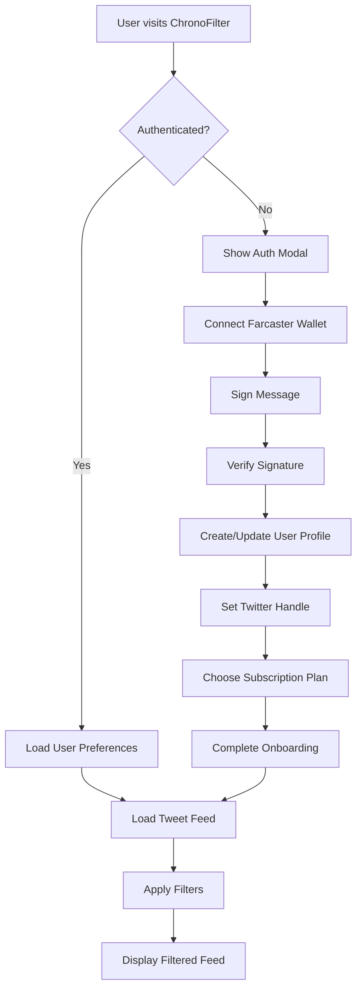
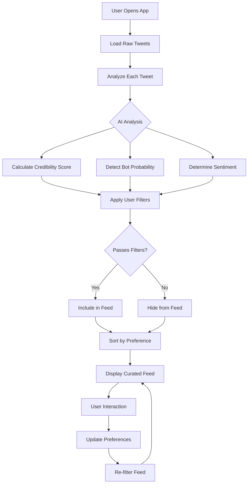

# ChronoFilter Technical Specifications

## Project Overview

**App Name**: ChronoFilter  
**Tagline**: Curate Your Twitter Feed, Reclaim Your Focus  
**Type**: Base Mini App  
**Version**: 1.0.0  
**Project ID**: 62e0169b-414a-4664-8171-82975891ef6e

## Architecture Overview

ChronoFilter is a React-based Base Mini App that provides intelligent Twitter feed filtering using AI-powered analysis and user preferences. The application follows a modern, scalable architecture with multiple service integrations.

### High-Level Architecture

```
┌─────────────────┐    ┌─────────────────┐    ┌─────────────────┐
│   Frontend      │    │   Services      │    │   External APIs │
│   (React)       │◄──►│   Layer         │◄──►│                 │
│                 │    │                 │    │   • OpenAI      │
│ • Components    │    │ • AI Service    │    │   • Farcaster   │
│ • State Mgmt    │    │ • User Service  │    │   • Supabase    │
│ • UI/UX         │    │ • Auth Service  │    │   • Airstack    │
└─────────────────┘    └─────────────────┘    └─────────────────┘
```

## Technology Stack

### Frontend
- **Framework**: React 18.2.0
- **Build Tool**: Vite 5.4.1
- **Styling**: Tailwind CSS 3.4.11
- **Icons**: Lucide React 0.263.1
- **State Management**: React Hooks (useState, useEffect)

### Backend Services
- **Database**: Supabase (PostgreSQL)
- **Authentication**: Farcaster + Wallet Signatures
- **AI Processing**: OpenAI GPT-3.5-turbo
- **Social Data**: Airstack API
- **Blockchain Data**: Etherscan API

### Development Tools
- **Package Manager**: npm
- **Bundler**: Vite
- **CSS Framework**: Tailwind CSS
- **PostCSS**: Autoprefixer
- **Environment**: Node.js

## Core Features Implementation

### 1. Algorithmic Credibility Filtering

**Purpose**: Analyze tweet sources and content to prioritize credible information.

**Implementation**:
```javascript
// AI-powered credibility analysis
const analyzeTweet = async (content) => {
  const analysis = await openai.chat.completions.create({
    model: "gpt-3.5-turbo",
    messages: [
      {
        role: "system",
        content: "Analyze tweet credibility based on factual claims, sources, and language patterns..."
      },
      { role: "user", content: `Analyze: "${content}"` }
    ]
  })
  
  return {
    credibilityScore: parseFloat(analysis.credibilityScore),
    sentiment: analysis.sentiment,
    botProbability: parseFloat(analysis.botProbability)
  }
}
```

**Scoring Factors**:
- Source authority and verification status
- Content factual accuracy indicators
- Language complexity and structure
- Presence of citations or references
- Historical accuracy of the source

### 2. Bot & Spam Detection

**Purpose**: Identify and filter automated or spam content.

**Detection Criteria**:
- Excessive emoji usage (>5 per tweet)
- High capitalization ratio (>30%)
- Promotional language patterns
- Repetitive content structures
- Account behavior patterns

**Implementation**:
```javascript
const detectBot = (content, authorMetrics) => {
  let botScore = 0
  
  // Content analysis
  const emojiCount = (content.match(/[\u{1F600}-\u{1F64F}]/gu) || []).length
  const capsRatio = (content.match(/[A-Z]/g) || []).length / content.length
  
  if (emojiCount > 5) botScore += 0.2
  if (capsRatio > 0.3) botScore += 0.2
  
  // Promotional indicators
  const spamKeywords = ['URGENT', 'GUARANTEED', 'BUY NOW', 'FOLLOW FOR MORE']
  spamKeywords.forEach(keyword => {
    if (content.includes(keyword)) botScore += 0.15
  })
  
  return Math.min(botScore, 1.0)
}
```

### 3. Source Credibility Management

**Purpose**: Allow users to manually curate their information sources.

**Features**:
- Preferred sources (prioritized in feed)
- Blocked sources (hidden from feed)
- Source reputation tracking
- Bulk source management

**Data Structure**:
```javascript
const userPreferences = {
  preferredSources: Set(['verified_journalist', 'tech_expert']),
  blockedSources: Set(['spam_account', 'bot_user']),
  credibilityThreshold: 0.7,
  sentimentPreference: 'neutral'
}
```

## Data Models

### User Entity
```typescript
interface User {
  id: string                    // UUID
  farcaster_id: string         // Unique Farcaster identifier
  twitter_handle?: string      // Optional Twitter handle
  preferred_sources: string[]  // Array of preferred usernames
  blocked_sources: string[]    // Array of blocked usernames
  sentiment_preference: 'positive' | 'neutral' | 'negative'
  credibility_threshold: number // 0.0 - 1.0
  hide_bots: boolean
  subscription_tier: 'free' | 'basic' | 'premium'
  subscription_status: 'active' | 'inactive' | 'cancelled'
  created_at: Date
  updated_at: Date
}
```

### Tweet Analysis Entity
```typescript
interface TweetAnalysis {
  id: string           // UUID
  tweet_id: string     // Unique tweet identifier
  content: string      // Tweet text content
  author_username: string
  credibility_score: number    // 0.0 - 1.0
  bot_probability: number      // 0.0 - 1.0
  sentiment: 'positive' | 'neutral' | 'negative'
  analyzed_at: Date
  created_at: Date
}
```

### User Interaction Entity
```typescript
interface UserInteraction {
  id: string           // UUID
  user_id: string      // Reference to User
  tweet_id: string     // Tweet identifier
  action: 'block_source' | 'prefer_source' | 'hide_tweet'
  created_at: Date
}
```

## Design System

### Color Palette
```css
:root {
  --primary: hsl(240, 80%, 50%);      /* #4338ca */
  --accent: hsl(180, 70%, 45%);       /* #0891b2 */
  --bg: hsl(220, 25%, 10%);           /* #1e293b */
  --surface: hsl(220, 25%, 15%);      /* #334155 */
  --text-primary: hsl(0, 0%, 95%);    /* #f1f5f9 */
  --text-secondary: hsl(0, 0%, 70%);  /* #94a3b8 */
}
```

### Typography Scale
```css
.text-display { font-size: 2.25rem; font-weight: 700; }  /* 36px */
.text-headline { font-size: 1.5rem; font-weight: 600; }  /* 24px */
.text-body { font-size: 1rem; font-weight: 400; line-height: 1.75; } /* 16px */
```

### Spacing System
```css
.space-sm { margin: 8px; }   /* 0.5rem */
.space-md { margin: 12px; }  /* 0.75rem */
.space-lg { margin: 20px; }  /* 1.25rem */
```

### Border Radius
```css
.rounded-sm { border-radius: 6px; }
.rounded-md { border-radius: 10px; }
.rounded-lg { border-radius: 16px; }
```

### Component Variants

#### TweetCard
- **Filtered**: Enhanced styling for filtered tweets
- **Original**: Standard tweet display
- **Blocked**: Dimmed appearance for blocked sources

#### SettingsSlider
- **Sentiment**: Sentiment preference control
- **SourcePriority**: Credibility threshold adjustment

#### SourceInput
- **Add**: Interface for adding preferred sources
- **Remove**: Interface for removing blocked sources

## User Flows

### 1. User Onboarding & Authentication



### 2. Content Curation & Filtering



## API Integration Specifications

### OpenAI Integration
- **Model**: GPT-3.5-turbo
- **Temperature**: 0.3 (consistent analysis)
- **Max Tokens**: 150 (cost optimization)
- **Rate Limiting**: 60 RPM (Tier 2)
- **Fallback**: Rule-based analysis

### Farcaster Integration
- **Authentication**: Wallet signature verification
- **Profile Data**: Username, display name, avatar
- **Social Graph**: Following/followers data
- **Casts**: User's post history

### Supabase Integration
- **Database**: PostgreSQL with RLS
- **Real-time**: Subscription to user preference changes
- **Storage**: User data and tweet analysis cache
- **Security**: Row-level security policies

## Performance Specifications

### Loading Performance
- **Initial Load**: < 3 seconds
- **Tweet Analysis**: < 500ms per tweet
- **Filter Application**: < 100ms
- **Settings Update**: < 200ms

### Scalability Targets
- **Concurrent Users**: 1,000+
- **Tweets per Hour**: 10,000+
- **API Requests**: 100,000+ per day
- **Database Queries**: < 50ms average

### Caching Strategy
- **Tweet Analysis**: 24-hour cache
- **User Preferences**: Local storage + database sync
- **API Responses**: 5-minute cache for static data

## Security Specifications

### Authentication Security
- **Wallet Signatures**: EIP-191 standard
- **Session Management**: JWT tokens (optional)
- **CSRF Protection**: SameSite cookies
- **Rate Limiting**: Per-user request limits

### Data Privacy
- **Encryption**: AES-256 for sensitive data
- **PII Handling**: Minimal collection, secure storage
- **GDPR Compliance**: Data deletion capabilities
- **Audit Logging**: User action tracking

### API Security
- **Key Management**: Environment variables
- **Request Validation**: Input sanitization
- **Error Handling**: No sensitive data in errors
- **HTTPS Only**: All API communications

## Deployment Specifications

### Build Configuration
```javascript
// vite.config.js
export default {
  build: {
    target: 'es2020',
    outDir: 'dist',
    sourcemap: true,
    minify: 'terser'
  },
  define: {
    'process.env.NODE_ENV': JSON.stringify(process.env.NODE_ENV)
  }
}
```

### Environment Variables
```bash
# Production Environment
VITE_OPENAI_API_KEY=sk-...
VITE_SUPABASE_URL=https://...
VITE_SUPABASE_ANON_KEY=eyJ...
VITE_FARCASTER_API_KEY=fc_...
VITE_AIRSTACK_API_KEY=...
VITE_ETHERSCAN_API_KEY=...
```

### Docker Configuration
```dockerfile
FROM node:18-alpine
WORKDIR /app
COPY package*.json ./
RUN npm ci --only=production
COPY . .
RUN npm run build
EXPOSE 3000
CMD ["npm", "run", "preview"]
```

## Testing Specifications

### Unit Testing
- **Framework**: Jest + React Testing Library
- **Coverage**: > 80% code coverage
- **Components**: All UI components tested
- **Services**: All service functions tested

### Integration Testing
- **API Mocking**: Mock all external APIs
- **User Flows**: Complete user journey testing
- **Error Scenarios**: Network failures, API errors

### Performance Testing
- **Load Testing**: Simulate 1000+ concurrent users
- **Stress Testing**: API rate limit testing
- **Memory Testing**: Memory leak detection

## Monitoring & Analytics

### Application Monitoring
- **Error Tracking**: Sentry integration
- **Performance**: Core Web Vitals tracking
- **User Analytics**: Privacy-compliant usage tracking
- **API Monitoring**: Response time and error rate tracking

### Business Metrics
- **User Engagement**: Daily/monthly active users
- **Feature Usage**: Filter usage statistics
- **Subscription Metrics**: Conversion rates
- **Content Quality**: Credibility score distributions

## Maintenance & Updates

### Version Control
- **Git Flow**: Feature branches + main
- **Semantic Versioning**: MAJOR.MINOR.PATCH
- **Release Notes**: Automated changelog generation

### Update Strategy
- **Hot Fixes**: Critical bug fixes
- **Feature Updates**: Monthly releases
- **API Updates**: Backward compatibility maintained
- **Database Migrations**: Automated with rollback

### Backup & Recovery
- **Database Backups**: Daily automated backups
- **Code Repository**: Multiple remote backups
- **Configuration**: Infrastructure as code
- **Disaster Recovery**: < 4 hour RTO

## Future Enhancements

### Planned Features (v2.0)
- **Advanced Analytics Dashboard**
- **Custom Filter Rules Engine**
- **Social Graph Analysis**
- **Multi-platform Support**
- **API Access for Premium Users**

### Technical Improvements
- **Server-Side Rendering (SSR)**
- **Progressive Web App (PWA)**
- **Offline Functionality**
- **Advanced Caching Layer**
- **Microservices Architecture**

## Compliance & Standards

### Web Standards
- **Accessibility**: WCAG 2.1 AA compliance
- **Performance**: Core Web Vitals optimization
- **SEO**: Meta tags and structured data
- **Security**: OWASP security guidelines

### Data Protection
- **GDPR**: European data protection compliance
- **CCPA**: California privacy compliance
- **SOC 2**: Security and availability controls
- **Privacy Policy**: Transparent data usage
